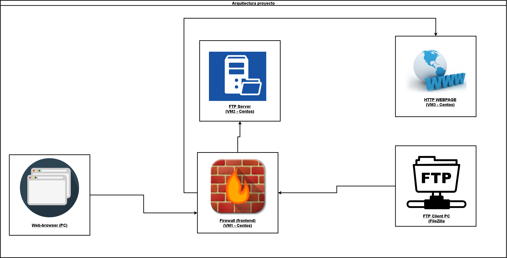

# Proyecto final **Seguridad Informática**

## Integrantes:

* Juan Esteban Alarcón Miranda
* Juan Diego Caicedo Rojas
* Juan Pablo Mora Sarria

## Sobre el proyecto:

Este proyecto está enfocado a la implementación de un firewall utilizando Kali Linux como distribución, en ese orden de ideas, se implementará 
un servicio Firewall el cual, a través de este la máquina anfitrión podrá acceder a un servicio FTP y una página web a través de un servicio seguro HTTP,
en este repositorio encontrará los archivos de configuración necesarios para desarrollar dicho proyecto, presentación y video demostrativo.

### Tecnologías:
    - Vagrant
    - Oracle VirtualBox
### Sistemas Operativos:
    - KaliLinux 
    - Centos 8
### Servicios a implementar:
    - Firewall
    - FTP
    - HTTPS
### Estructura planteada:

