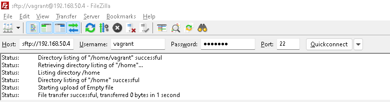
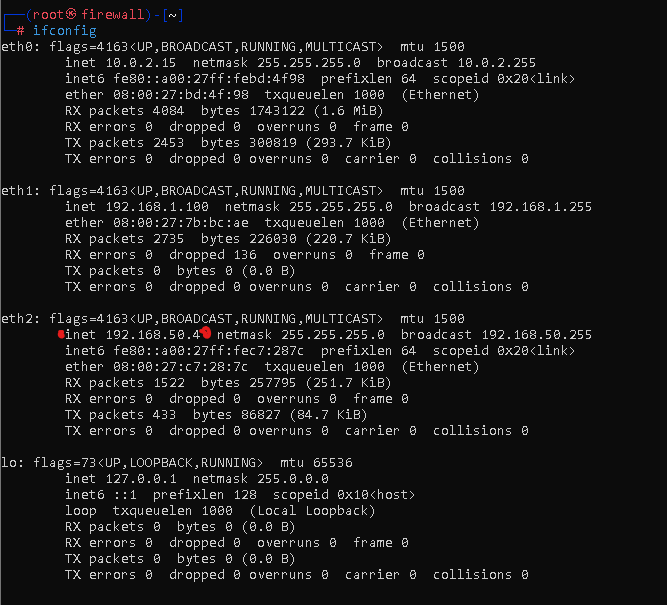

# Configuración Servidor FTP

### Instalación de dependencias:
 
```bash
sudo -i
apt install nano net-tools vsftpd -y
service vsftpd start / restart / stop / status
systemctl enable vsftpd
```

## Verificación de la configuración:

- Accediendo al servicio SFTP desde FileZilla a través de la máquina **Firewall**:


- Verificando la IP de la máquina **Firewall** de la cual estamos accediendo:

