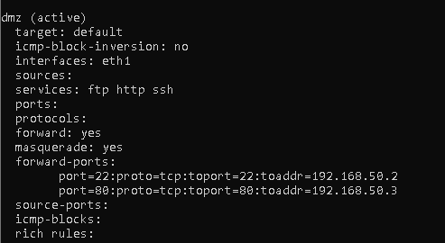
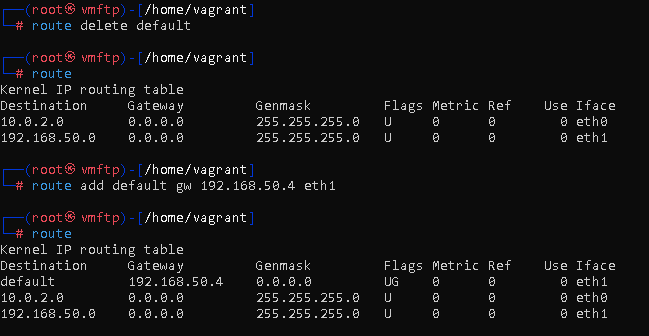
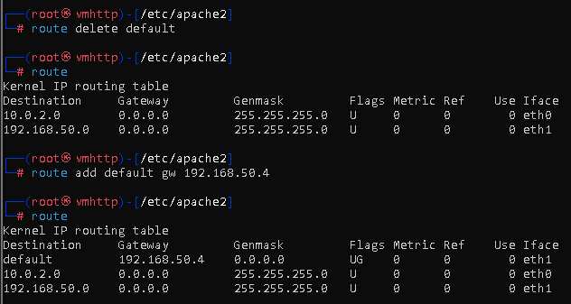

# Servidor Firewall (frontend)

## Comandos de configuración firewall:

```bash
- sudo -i
- service firewalld start
- service NetworkManager stop
- chkconfig NetworkManager off
 
- firewall-cmd --get-zones
- firewall-cmd --list-all-zones
- firewall-cmd --get-active-zones

- firewall-cmd --zone=dmz --add-interface=eth1 --permanent

- firewall-cmd --zone=dmz --add-service=http --permanent
- firewall-cmd --zone=dmz --add-service=ftp --permanent

- firewall-cmd --zone=internal --add-interface=eth2 --permanent
- firewall-cmd --permanent --zone=dmz --add-masquerade
- firewall-cmd --permanent --zone=internal --add-masquerade
- firewall-cmd --permanent --zone="dmz" --add-forward-port=port=22:proto=tcp:toport=22:toaddr=192.168.50.2
- firewall-cmd --permanent --zone="dmz" --add-forward-port=port=80:proto=tcp:toport=80:toaddr=192.168.50.3
- firewall-cmd --reload
- service firewalld start
```

## Instalaciones necesarias:

```bash
sudo -i
apt install firewalld nano net-tools -y
```

## Verificación de la configuración:

- Configuración de las zonas y los servicios permitidos de forma permanente:


- Configuración de las máquinas vmftp y vmhttp para su puerta de enlace:

* Máquina vmftp


* Máquina vmhttp


