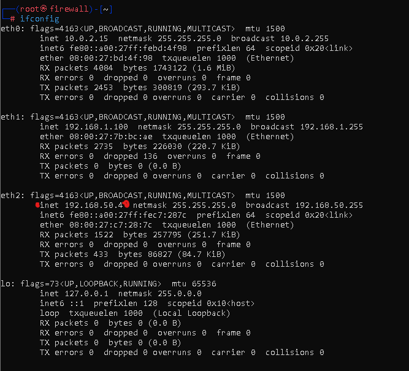

# Configuración Servidor HTTP

### Instalación de dependencias:

bash```
sudo -i
apt install apacha2 nano net-tools -y
service apache2 restart / start / status / stop
systemctl enable apache2
```

**Nota:** En el caso de KaliLinux para instalar el servicio HTTP utilizamos apache2, lo cual lo aplicamos ninguna configuración extra más que personalizar nuestro index.html.

## Verificación de la configuración:

- Accediendo al servicio HTTP de la máquina **vmhttp** desde el firewall:


- Verificando la IP de la máquina **Firewall** de la cual estamos accediendo:
